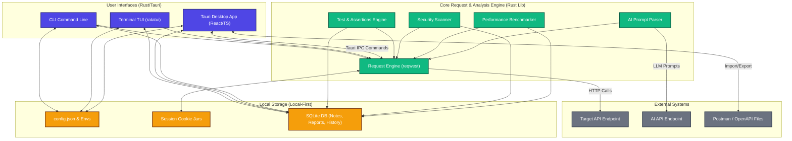

# ⚡️ zapreq

> **A blazing fast, developer-friendly HTTP client — HTTPie reimagined in Rust, featuring a TUI, a Tauri GUI, Local Regression Testing, and an AI Assistant.**

[](https://crates.io/crates/zapreq)
[](https://github.com/MFAIZAN20/zapreq/actions/workflows/ci.yml)
[](#license)
[](https://www.rust-lang.org)
[](https://crates.io/crates/zapreq)

`zapreq` is a next-generation API client that installs as a single, lightweight binary. It ships with `http` as a compatibility alias. If you know HTTPie, you already know `zapreq` — it features the same clean syntax, but boasts sub-5ms startup times, minimal memory usage, and an ecosystem of local-first tools (TUI, Tauri GUI, Regression Suite, Security Scanner, AI Assistant) that Postman and HTTPie do not ship out of the box.

---

## 🗺️ Table of Contents

- [✨ Core Highlights](#-core-highlights)
- [📦 Installation](#-installation)
- [🚀 Quick Start](#-quick-start)
- [🧭 Request Items Syntax](#-request-items-syntax)
- [🎨 Output Customization](#-output-customization)
- [🔐 Authentication Profiles](#-authentication-profiles)
- [🔄 Sessions & Cookie Persistence](#-sessions--cookie-persistence)
- [🌐 Environment Profiles](#-environment-profiles)
- [📂 Hierarchical Collections & Drag-and-Drop](#-hierarchical-collections--drag-and-drop)
- [🖥️ Tauri Desktop GUI](#-tauri-desktop-gui)
- [📟 Terminal TUI](#-terminal-tui)
- [🧪 API Testing & Regression Suites](#-api-testing--regression-suites)
- [📊 Performance Benchmarking](#-performance-benchmarking)
- [🛡️ Local Security Scanner](#-local-security-scanner)
- [📝 Local Notes & Revision History](#-local-notes--revision-history)
- [📖 API Documentation Generator](#-api-documentation-generator)
- [🧠 AI Request Assistant](#-ai-request-assistant)
- [⚖️ Response Diffing](#-response-diffing)
- [📥 Resumeable Download Mode](#-resumeable-download-mode)
- [⚙️ Configuration Reference](#-configuration-reference)
- [🔌 Extension Plugins](#-extension-plugins)
- [📊 zapreq vs. curl vs. HTTPie](#-zapreq-vs-curl-vs-httpie)
- [🛠️ Contributing](#-contributing)
- [📄 License](#-license)
- [🏗️ System Architecture](#️-system-architecture)

---

## 🏗️ System Architecture

The following diagram illustrates how the `zapreq` CLI, terminal TUI, and Tauri desktop GUI interface with the core request engine, security scanners, test runners, and local SQLite/JSON storage:



---

## ✨ Core Highlights

* **Single Native Binary (~3 MB):** Zero Python dependencies, virtual environments, or Node runtimes. 
* **⚡️ Sub-5ms Startup Time:** Instantly fires requests. HTTPie takes ~200ms due to Python interpreter overhead.
* **📂 Hierarchical Workspaces:** Organise requests into collapsible folder structures using `/` delimiters, with full interactive drag-and-drop support in the Tauri GUI.
* **🧪 Local Test Automation:** Write API assertions (`--expect-status`, `--expect-json`) directly in the shell and run recursive test suites with a visual history dashboard.
* **🛡️ Security First:** Local-first static and live scanning for sensitive headers, exposed credentials, missing HTTPS transport, and overly permissive APIs.
* **🧠 AI-Powered Execution:** Generate requests and explain execution paths using natural language descriptions powered by LLMs.
* **📟 Multi-modal:** Fluidly transition between raw **CLI commands**, a keyboard-driven terminal **TUI**, or a modern **Desktop GUI** sharing the same local database.

---

## 📦 Installation

### Cargo (Rust Toolchain)
```bash
cargo install zapreq
```

### Binary Downloads
Pre-built binaries for Linux, macOS (x86_64 + Apple Silicon), and Windows are attached to every [GitHub release](https://github.com/MFAIZAN20/zapreq/releases). Download the binary and place it in your system `PATH`.

### Package Managers

```bash
# Arch Linux (AUR)
yay -S zapreq

# macOS or Linux (Homebrew Tap)
brew tap MFAIZAN20/zapreq
brew install zapreq
```

---

## 🚀 Quick Start

```bash
# 1. Simple GET request
zapreq GET https://httpbin.org/get

# 2. POST request with JSON payload (inferred from arguments)
zapreq POST https://httpbin.org/post name="Faizan" age:=22 active:=true

# 3. Form-encoded payload
zapreq --form POST https://httpbin.org/post username=faizan status=active

# 4. Custom Request Headers & Query Parameters
zapreq GET https://httpbin.org/get X-API-Token:secretKey page==2 limit==10

# 5. HTTP Digest Authentication (includes automatic 401 challenge retry)
zapreq --auth-type digest --auth user:pass https://httpbin.org/digest-auth/auth/user/pass

# 6. Save a request into a Collection Workspace
zapreq requests save api-v1 get-user -- GET https://api.example.com/users/{USER_ID}
```

---

## 🧭 Request Items Syntax

`zapreq` uses positional arguments after the URL to define query params, headers, and body payloads. The operator character determines the data type.

| Operator | Syntax Type | Example | Compiled Output |
|---|---|---|---|
| `:` | Request Header | `X-Custom-Header:value` | `X-Custom-Header: value` |
| `=` | String Body Field | `username=faizan` | `"username": "faizan"` |
| `:=` | Raw JSON Field | `items:=["a", "b"]` | `"items": ["a", "b"]` |
| `==` | Query Parameter | `search==rust` | `?search=rust` |
| `@` | File Upload | `avatar@/tmp/avatar.png` | Multipart form file |
| `@` with MIME | File with MIME | `data@/tmp/data.bin;type=application/octet-stream` | Explicit MIME file attachment |
| `=@` | String Field from File | `pubkey=@~/.ssh/id_ed25519.pub` | File content read as string |
| `:=@` | JSON Field from File | `config:=@/tmp/config.json` | File content parsed as JSON |

> 💡 **Precedence Order:** Operator parsing evaluates from left to right with strict precedence: `:=` / `:=@` ➔ `==` ➔ `:` ➔ `=` / `=@` ➔ `@`.

---

## 🎨 Output Customization

Fine-tune output verbose levels, syntax themes, and color formatting.

```bash
# Print response headers only (useful for status checks)
zapreq --print=h GET https://httpbin.org/get

# Print request + response headers (no body payload)
zapreq --print=Hh GET https://httpbin.org/get

# Print full details (Request headers/body + Response headers/body)
zapreq --verbose GET https://httpbin.org/get

# Change color theme (supported: monokai, solarized, dracula, autumn)
zapreq --style=dracula GET https://httpbin.org/json

# Format output summary line (Status code, latency, content length)
zapreq --summary GET https://httpbin.org/get
```

### `--print` Flags Matrix
Combine these flags together (e.g. `--print=Hb`):
* `H`: Request headers
* `B`: Request body payload
* `h`: Response headers
* `b`: Response body payload

---

## 🔐 Authentication Profiles

`zapreq` provides comprehensive authentication protocols. Passed credentials are automatically masked as `****` in `--verbose` outputs.

```bash
# HTTP Basic Auth (default type)
zapreq --auth admin:super_secret https://api.example.com/me

# OAuth2 / Bearer Token
zapreq --auth-type bearer --auth "eyJhbGciOi..." https://api.example.com/me

# HTTP Digest Auth (RFC 7616 - supports MD5 & SHA-256 with handshake sequence)
zapreq --auth-type digest --auth admin:password https://api.example.com/protected
```

---

## 🔄 Sessions & Cookie Persistence

Sessions serialize cookie jars, headers, and authentication parameters locally, allowing you to persist API state between independent CLI invocations. Sessions are saved in `~/.config/zapreq/sessions/{hostname}/{session_name}.json`.

```bash
# Authenticate and initialize a session named 'dev-user'
zapreq --session dev-user POST https://api.example.com/login username=faizan password=secret

# Subsequent requests automatically load and write back updated cookie updates
zapreq --session dev-user GET https://api.example.com/dashboard

# Load session in read-only mode (prevents updating the cookie jar on response)
zapreq --session-read-only dev-user GET https://api.example.com/analytics
```

---

## 🌐 Environment Profiles

Easily manage variables across environmental configurations (`dev`, `staging`, `prod`). Profiles are JSON files saved in `~/.config/zapreq/envs/{profile_name}.json`.

### Example Profile File (`prod.json`)
```json
{
  "base_url": "https://api.production.internal",
  "headers": {
    "X-Client-Version": "4.2"
  },
  "variables": {
    "USER_ID": "893",
    "ROLE": "admin"
  }
}
```

### CLI Substitution
Tokens matching `{KEY}` in the URL or request parameters are replaced dynamically:
```bash
zapreq --env-profile prod GET /users/{USER_ID}/permissions role={ROLE}
```

---

## 📂 Hierarchical Collections & Drag-and-Drop

Organize saved API requests in namespaces and folder hierarchies. Workspaces store requests under named aliases in a local database.

### Command Line Workspace Actions
```bash
# Create a new workspace
zapreq collections new payments

# Save a request under a hierarchical folder segment path (using `/` delimiters)
zapreq requests save payments "Billing / Invoices / Get Invoice" -- GET https://api.example.com/invoices/{ID}

# List all requests in a workspace
zapreq requests list payments

# Run a saved request (replaces tokens dynamically)
zapreq requests run payments "Billing / Invoices / Get Invoice" ID=56
```

### Drag-and-Drop Organizing
In the Tauri Desktop GUI, folders and request nodes are displayed in a clean directory tree. You can drag and drop request items to relocate them between folders or drag them to the root panel zone. Moving requests automatically updates their database path names. Empty folders are tracked and preserved on screen when child elements are moved or deleted.

---

## 🖥️ Tauri Desktop GUI

Open the fully integrated desktop interface by running `zapreq` without subcommands or calling `gui` explicitly:

```bash
zapreq
# or
zapreq gui
```

### GUI Key Capabilities:
* **Multi-pane Layout:** Workspace directory tree (left), Request Editor & tabbed controls (center), Response Viewer (right).
* **Workspace Management:** Interactive creation, migration, import, and export of workspace definitions (Zapreq, Postman, and OpenAPI schemas supported).
* **Tabs-based Request Builders:** Dedicated visual sections for query parameters, custom headers, body fields (JSON, URL Form, Multipart, Raw File), script editors, and authorization.
* **Regression Suites Tab:** Run automated test suites sequentially with visual progress bars and live status feedback.
* **Interactive Summary Dashboard:** A homepage view featuring an animated SVG Donut Chart showing test pass/fail distributions and a scrollable feed of recent request runs with latency metrics.

---

## 📟 Terminal TUI

For keyboard-first developers, `zapreq` includes a full-featured terminal workspace TUI built in Rust:

```bash
zapreq tui
```

It supports workspace switching, interactive request running, headers/body tab toggle, and environment variable expansions using native terminal widgets.

---

## 🧪 API Testing & Regression Suites

Perform automated assertions on API responses. Test suites and execution history are stored in a local SQLite file.

### CLI Ad-hoc Assertions
```bash
# Assert HTTP status and header patterns
zapreq test --expect-status 200 --expect-header content-type~json -- GET https://httpbin.org/json

# Assert nested JSON keys using dot-notation syntax
zapreq test --expect-json slideshow.slides[0].title="Wake up!" -- GET https://httpbin.org/json
```

### Local Regression Suites
Create test suites and cases to execute multiple requests in sequence.

```bash
# Add a regression test case linking to a saved workspace request
zapreq regression add smoke-tests check-auth --workspace payments --request "Billing / Get Token" --expect-status 200

# List cases in a suite
zapreq regression list --suite smoke-tests

# Run a suite
zapreq regression run smoke-tests

# Inspect test history for a specific case
zapreq regression history smoke-tests check-auth
```

---

## 📊 Performance Benchmarking

Benchmark endpoint response times and latencies locally.

```bash
# Run a request 100 times in sequence to measure latency metrics
zapreq perf benchmark --alias get-users --iterations 100

# Benchmark a workspace over a specific duration (runs continuously for 30s)
zapreq perf benchmark --workspace payments --duration-secs 30
```

### Benchmark Metrics Tracked:
* **Iterations & Success Rate:** Number of executions, HTTP 2xx vs. 4xx/5xx status rates, and network errors.
* **Latency Distribution:** $min$, $p50$ (median), $p95$ (tail latency), $p99$, and $max$ execution times in milliseconds.
* **Payload Size Analysis:** Total headers and body size processed.

---

## 🛡️ Local Security Scanner

Scan saved requests, imported schemas, or live endpoints to check for security vulnerabilities.

```bash
# Scan a specific saved command alias
zapreq security scan --alias login-api

# Scan an entire workspace for vulnerabilities with a severity filter
zapreq security scan --workspace staging --severity high

# Perform a live active scan (executes safe GET/HEAD requests to check live response headers)
zapreq security scan --alias fetch-profile --live
```

### Issues Scanned & Flagged:
* **HTTPS Transport:** Flag requests communicating over unencrypted `http://`.
* **Credential Exposure:** Detect secrets, API keys, private keys, or passwords saved inside request text fields.
* **Sensitive Query Parameters:** Warn against sending tokens or credentials in the URL query string.
* **Missing Security Headers:** Detect absence of `Content-Security-Policy`, `X-Content-Type-Options`, `Strict-Transport-Security`, etc., during live checks.
* **Excessive Data Exposure:** Analyzes live payloads for potential over-fetching of sensitive user metadata.

---

## 📝 Local Notes & Revision History

Document your endpoints directly inside `zapreq` with local notes linked to aliases, workspaces, or requests. Notes keep a local version history in SQLite.

```bash
# Add a note with tags
zapreq notes add --alias get-users --title "Authentication Required" --tag security "Requires a valid JWT token. Token expires every 2 hours."

# List and search notes
zapreq notes list --query JWT

# View note edit revisions
zapreq notes history 1
```

---

## 📖 API Documentation Generator

Generate documentation files locally from workspace definitions.

```bash
# Generate clean Markdown documentation
zapreq docs generate --workspace payments --format markdown --output ./docs.md

# Generate static HTML API documentation
zapreq docs generate --workspace payments --format html --output ./dist/docs.html

# Export workspace schema as an OpenAPI 3.0 specification file
zapreq docs generate --workspace payments --format openapi --output ./openapi-spec.json
```

---

## 🧠 AI Request Assistant

Translate plain English prompts into runnable HTTP commands using LLMs. Provide your OpenAI-compatible endpoint key:

```bash
export ZAPREQ_AI_KEY=sk-...
```

```bash
# Describe a request in natural language (defaults to dry-run verification mode)
zapreq ai "GET https://api.github.com/repos/MFAIZAN20/zapreq with User-Agent header"

# Generate and immediately send the request
zapreq ai "POST request to https://httpbin.org/post with username Faizan" --send

# Explain how the generated command was built
zapreq ai "GET users limit 5" --explain
```

---

## ⚖️ Response Diffing

Flatten two JSON response payloads and compare them side by side. Highlights differences in keys, structure types, and values.

```bash
zapreq diff https://api.example.com/v1/users/1 https://api.example.com/v2/users/1
```

### Example Visual Diff Output
```diff
A: GET https://api.example.com/v1/users/1  →  200 OK
B: GET https://api.example.com/v2/users/1  →  200 OK

   id          1
   name        "Faizan"
-  role        "admin"            (only in A)
+  privilege   "super_admin"      (only in B)
~  updated_at  "2026-01-01"  ➔  "2026-06-18"
```

---

## 📥 Resumeable Download Mode

Download large files from the command line with standard visual progress indicators.

```bash
# Download file, saving to current directory
zapreq --download https://example.com/large-bundle.iso

# Continue/resume a partial download
zapreq --download --continue --output bundle.iso https://example.com/large-bundle.iso
```

---

## ⚙️ Configuration Reference

Configuration parameters are stored in `~/.config/zapreq/config.json`.

```json
{
  "default_options": ["--style=dracula"],
  "default_scheme": "https",
  "plugins_dir": "~/.config/zapreq/plugins",
  "output_theme": "dracula",
  "pretty": "all",
  "verify": true
}
```

| Config Parameter | Value Type | Default Value | Description |
|---|---|---|---|
| `default_options` | `string[]` | `[]` | CLI flags prepended before every command execution |
| `default_scheme` | `string` | `"https"` | HTTP scheme assumed when URL lacks scheme prefix |
| `plugins_dir` | `string` | `"~/.config/zapreq/plugins"` | Path scanned for TOML plugin definitions |
| `output_theme` | `string` | `"monokai"` | Syntax highlighting style theme |
| `pretty` | `string` | `"all"` | Formatting mode (`all`, `colors`, `format`, `none`) |
| `verify` | `boolean` | `true` | Enable/disable TLS certificate verification checks |

---

## 🔌 Extension Plugins

`zapreq` discovers external plugins via TOML manifests located in `plugins_dir`.

### Example Plugin Manifest (`aws-hmac.toml`)
```toml
[plugin]
name        = "aws-hmac"
version     = "1.2.0"
description = "AWS Signature Version 4 Signing"
auth_types  = ["aws"]
executable  = "./aws-hmac-plugin"
```

### Plugin CLI Commands
```bash
# List all registered plugins
zapreq plugins list

# Verify plugin manifest configuration and permissions
zapreq plugins validate

# Run a plugin binary manually
zapreq plugins run aws-hmac -- --help
```

---

## 📊 zapreq vs. curl vs. HTTPie

| Capability | `curl` | HTTPie | `zapreq` |
|---|---|---|---|
| **Syntax Style** | Verbose / Low-level | Clean / Developer-focused | Clean / Developer-focused |
| **Startup Overhead** | Minimal (< 3ms) | Slow (~200ms) | **Minimal (< 5ms)** |
| **Dependencies** | None (C library) | Python Runtime (~15MB) | **None (Self-contained binary)** |
| **Named Sessions** | ❌ | ✅ | **✅** |
| **Tauri Desktop GUI** | ❌ | ❌ | **✅ (`zapreq gui`)** |
| **Terminal TUI Interface** | ❌ | ❌ | **✅ (`zapreq tui`)** |
| **Regression Testing** | ❌ | ❌ | **✅ (`zapreq test` / `regression`)** |
| **Performance Benchmarks** | ❌ | ❌ | **✅ (`zapreq perf`)** |
| **Local SQLite DB** | ❌ | ❌ | **✅ (Reports, Notes, History)** |
| **AI Assistant** | ❌ | ❌ | **✅ (`zapreq ai`)** |
| **Response Diffing** | ❌ | ❌ | **✅ (`zapreq diff`)** |

---

## 🛠️ Contributing

1. Clone the repository:
   ```bash
   git clone https://github.com/MFAIZAN20/zapreq.git
   cd zapreq
   ```
2. Run unit and integration tests:
   ```bash
   cargo test --all
   ```
3. Run code formatting and lint checkers:
   ```bash
   cargo fmt --all
   cargo clippy --all-targets --all-features -- -D warnings
   ```
4. Build release binaries:
   ```bash
   cargo build --release
   ```

---

## 📄 License

Licensed under either of the following, at your option:
* **MIT License** ([LICENSE-MIT](LICENSE-MIT))
* **Apache License, Version 2.0** ([LICENSE-APACHE](LICENSE-APACHE))

Standard Rust ecosystem dual licensing applies.

Copyright © 2026 Muhammad Faizan. All rights reserved.
